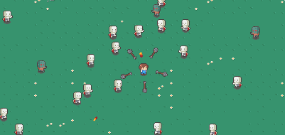
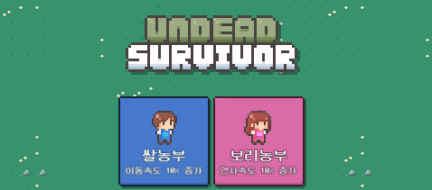

# Undead-Survivor
<!-- -->
<table>
  <tr>
    <td></td>
    <td></td>
  </tr>
</table>

## 유니티로 만든 뱀파이어 서바이벌 게임의 모작

## 호환성
이 프로젝트는 **Unity 2021.3.13f1*을 기준으로 제작되었습니다. 

## 다운로드
### 권장 : 압축파일 다운로드
다음 링크에서 압축 파일을 다운로드 합니다.
apk를 모바일에서 다운받을 시 직접 플레이해 볼 수 있습니다. 바이러스는 없으며 안전한 프로그램 입니다:)
https://drive.google.com/drive/folders/1KylBZUsS4UoJIs2-BHOPVKdlnQ66QNrk?usp=drive_link

> __주의사항__: 
> 이 저장소는 script 코드만을 올려놓았습니다. 프로젝트 전반은 위 드라이브 링크에서 zip으로 다운로드해주시길 바랍니다.
>  깃허브 오른쪽 상단의 초록색 버튼 > 'Downloading Zip'으로는 파일을 정상적으로 다운로드 할 수 없습니다.

## 기획 및 개발 일지 
아래 노션 페이지를 참고 해주세요. 코드의 완성도가 낮은 프로토타입입니다.(20241014 기준) 
https://bittersweet-camelotia-08e.notion.site/11732acd6bd1801f966de0273e79c978

# 기타 전달사항
2024-10-14일자 기준 미완성된 프로토타입이며 업데이트를 하며 개선될 예정입니다.
